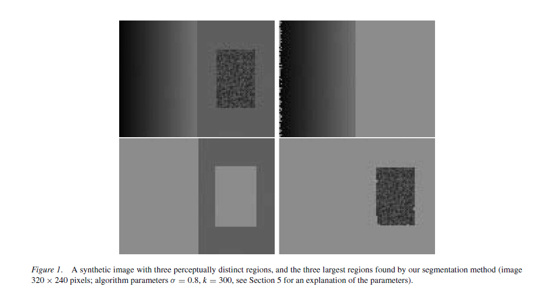

# Efficient-Graph-Based-Image-Segmentation
This section is to replicate the algorithm proposed by Felzenszwalb, P.F. and Huttenlocher, D.P.(Efficient graph-based image segmentation) by **python**

You can find the paper via http://cs.brown.edu/people/pfelzens/papers/seg-ijcv.pdf 

The authors also implement the alorithm in C++ and you can find it via http://cs.brown.edu/people/pfelzens/segment/

## Paper knowledge
In this part, I will illustrate authors' idea and notation :monocle_face:

**Non-local image characteristic** captured by this segmentation method

Let's us now disregard the two hyperparameters &sigma and k now, which will be explained later 

Consider the image shown in the top left of Fig. 1. 
Most people will say that this image has **three distinct regions**: 
- a rectangularshaped intensity ramp in the left half **(Region 1)**
- a constant intensity region with a hole on the right half **(Region 2)**
- a high-variability rectangular region inside the constant region **(Region 3)**

So this example illustrates some perceptually **important properties** that we believe should be captured by a segmentation algorithm.
1. Widely varying intensities should not alone be judged as evidence for multiple regions. Such wide variation in intensities occurs both
  in the ramp on the left **(Region 1)** and in the high variability region **(Region 3)** on the right. Thus it is not adequate to assume
  that regions have nearly constant or slowly varying intensities.
2. In Fig. 1 is that the three regions cannot be obtained using purely local decision criteria. This is because the intensity difference across the boundary **(Region 1 and 2)**    between the ramp and the constant region is actually smaller than many of the intensity differences within the high variability region **(Region 3)**. Thus, in order to          segment such an image, some kind of adaptive or non-local criterion must be used.

The remaining parts of Fig. 1 show the three largest regions found by our algorithm. Although this method makes greedy decisions, it produces results
that capture certain global properties which are derived below and whose consequences are illustrated by the example in Fig. 1.

**Graph-based segmentation**

## Code details
 represents an undirected graph with vertices 
