# Efficient-Graph-Based-Image-Segmentation
This section is to replicate the algorithm proposed by Felzenszwalb, P.F. and Huttenlocher, D.P.(Efficient graph-based image segmentation) by **python**

You can find the paper via http://cs.brown.edu/people/pfelzens/papers/seg-ijcv.pdf 

The authors also implement the alorithm in C++ and you can find it via http://cs.brown.edu/people/pfelzens/segment/

## Highlight
1. The algorithm can capture important **non-local properties**
2. The algorithm is computationally efficient - running in O(nlogn) for n image pixels

## Paper knowledge

### Non-local image characteristic

 
Most people will say that this image(shown above) has **three distinct regions**: 
- a rectangularshaped intensity ramp in the left half **(Region 1)**
- a constant intensity region with a hole on the right half **(Region 2)**
- a high-variability rectangular region inside the constant region **(Region 3)**

So above image illustrates some perceptually **important properties** that should be captured by a segmentation algorithm.
1. Widely varying intensities should not alone be judged as evidence for multiple regions. For example,such wide variation in intensities occurs both
  in the ramp on the left **(Region 1)** and in the high variability region on the right **(Region 3)**. Thus it is not adequate to assume
  that regions have nearly constant or slowly varying intensities.
2.  Three regions **(Region 1,2,3)** cannot be obtained using purely local decision criteria. This is because the intensity difference across the boundary **(Region 1 and 2)**    between the ramp and the constant region is actually smaller than many of the intensity differences within the high variability region **(Region 3)**. Thus, in order to          segment such an image, some kind of adaptive or non-local criterion must be used.

Wrong segmentation

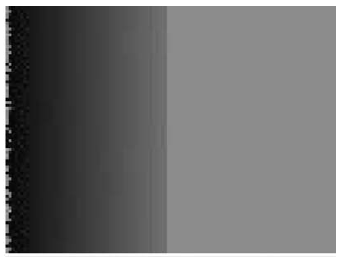  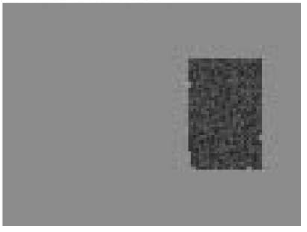

Correct segmentation

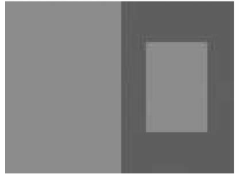

### Graph-based segmentation

 represents an undirected graph with vertices and edges

In the image segmentation,

For vertices ,  they are pixels

For egdes , they are pairs of neighboring vertices. 
Each edge has a corresponding weight  , which is non-negative measure of dissimilarity between neighboring  and . 
In terms of definition of weight function, it will be discussed later

A segmentation *S* is a partition of vertices into components such that each components(or region) 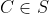 corresponds to a connected component in a graph
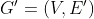 ,where 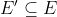

Note: You can think S includes all components.Within each component, it has connections between vertices. One segmentation is different from other segmentation by how it divides the vertices

### Pairwise Region Comparison Predicate
This section defines a predicate for evaluating whether or not there is evidence for a boudary between two components in a segmentation(two regions of an image)

**Internal difference**:it measures difference within one component and it is the largest weight in the minimum spanning tree of the component
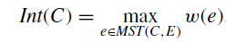

In the extreme case, if one component contains only one vertice(i.e single pixel),when |C|=0, Int(C)=0

**External difference**: it measures difference between two components and it is the minimum weight edge conneting two components
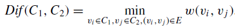

If there is no edge connneting C1 and C2, then  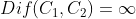

Based on two definitions above, we further define **Boundary threshold**

**Boundary threshold**

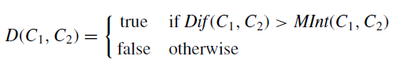

Where the minimum internal difference,MInt, is defined as 

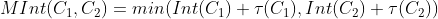

In summary, the overall idea is if external difference is larger than the internal difference, then boudary can be formed

Note: The threshold function τ controls the degree to which external difference must be greater than their internal differences 
in order for there to be evidence of a boundary between them (D to be true).

The reason why we have this threshold function τ is explained as follows:
For small components(which means component includes few vertices), using Int(C) is not a good estimate of the local characteristics of the data
In the extreme case,when |C| = 1, Int(C) = 0. Then the internal difference is samll and helps to form the boundary and may lead to multiple components, which may in essence
can be included in one component.

Therefore, we use a threshold function based on the size of the component, τ (C) = k/|C|, where |C| denotes the size of C, and k is some constant parameter(hyperparameter)
That is, for small components we require stronger evidence for a boundary. A larger k causes a preference for larger components. Note, however, that k is not a minimum component size. Smaller components are allowed when there is a sufficiently large difference between neighboring components.

## Algorithm and its properties

The algorithm is closely related to Kruskal’s algorithm for constructing a minimum spanning tree of a graph (cf. Cormen et al.,
1990). It can be implemented to run in O(m logm) time, where m is the number of edges in the graph.

First, introduce the algorithm process 

Input:  with n vertices and m edges

Output: a segmentation of V into components 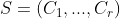

Process:

1. Sort E into π=(O1,...Om) by non-decreasing edge weight.
2. Start with a segmentation S0, where each vertex vi is in its own component. (Initialization)

(For clarity, we notice there is superscript of 0 on S. Because the whole process is iterative, the superscript indicates the ith updates of S after considering ith edges)

3. Repeat step 4 for q=1,2,...m, which means considering each edge 
4. Construct Sq given Sq-1 as follows.(it means that the segmentation evolve iteratively)
   
   Let vi and vj denote the vertices connected by the q-th edge in the ordering, i.e., oq = (vi, vj ).

   If vi and vj are in disjoint components of Sq-1 and w(oq ) is small compared to the internal difference of both those components,       then merge the two components
   
   otherwise do nothing.
   
   (Note: in terms of the merging criterion, basically it uses **boundary threshold**)
   
   To formulate it in math way:
   
   Let 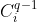 be the component of Sq-1 containing vi and   be the component containing vj
   
   if 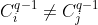 and 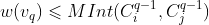, 
   
   then Sq is obtained from  Sq-1 by merging  and 
   
   Otherwise, Sq = Sq-1
   
   (Currently, the status is Sq-1 and   )
   
   
   
 4. Return S=Sm
   
   
 Then, let's focus on the algorithm property
 
 Definition 1. A segmentation S is **too fine** if there is some pair of regions C1,C2 ∈ S for which there is no evidence for a boundary between them.
 
 (it means that the condition for **boundary threshold** is not satisfied)
 
In order to define the complementary notion of what it means for a segmentation to be too coarse (to have too few components), 

we first introduce the notion of a **refinement** of a segmentation.

Given two segmentations S and T of the same base set, we say that T is a **refinement** of S when each component of T is contained in (or equal to) some component of S.

In addition(**add one more constraint**), we say that T is a **proper** refinement of S when T ≠ S. 
Note that if T is a proper refinement of S, then T can be obtained by splitting one or more regions of S. When T is a **proper** refinement of S we say that T is finer than
S and that S is coarser than T.

Definition 2.A segmentation S is too coarse when there exists a proper refinement of S that is not too fine.
 
Notice: from definition 2, if regions of a segmentation can be further split according to the **boundary threshold**, then the initial segmentation has too few regions.

First we note that in general there can be more than one segmentation that is neither too coarse nor too fine, so such a segmentation is not unique.On the question of existence, there is always some segmentation that is both not too coarse and not too fine.

Property 1. For any (finite) graph G = (V, E) there exists some segmentation S that is neither too coarse nor too fine.

Proof: Consider the segmentation where all the elements are in a single component. Clearly this segmentation is not too fine, because there is only one component. 
If the segmentation is also not too coarse we are done. 
Otherwise, by the definition of "too coarse" there is a proper refinement that is not too fine. Pick one of those refinements and keep repeating this procedure
until we obtain a segmentation that is not too coarse.
The procedure can only go on for n − 1 steps because whenever we pick a proper refinement we increase the number of components in the segmentation by at least
one, and the finest segmentation we can get is the one where every element is in its own component.(n should be the # of vertices)

 

Lemma 1.In Step 4 of the algorithm, when considering edge oq , if two distinct components are considered and not merged, 
then one of these two components will be in the final segmentation. 

Let  and  denote the two components connected by edge oq = (vi, vj )
when this edge is considered by the algorithm. (Result:)Then either Ci =   or Cj =  , 
where Ci is the component containing vi and Cjis the component containing vj in the final segmentation S.

Note: this means that if two components fail to merge, then one of two components will remain unchanged to the end.

Proof: There are two cases in which the merging will not happen. Say it is 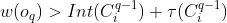 
Since edges are considered in non-decreasing weight order,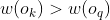 for all k ≥ q + 1.
Thus no additional merges will happen to this component, i.e., Ci =. 
The case for 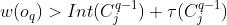 is analogous.

Overall flow：
Input imgae -> gaussian filter ->  predicate

