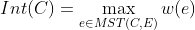
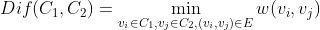

# Efficient-Graph-Based-Image-Segmentation
This section is to replicate the algorithm proposed by Felzenszwalb, P.F. and Huttenlocher, D.P.(Efficient graph-based image segmentation) by **python**

You can find the paper via http://cs.brown.edu/people/pfelzens/papers/seg-ijcv.pdf 

The authors also implement the alorithm in C++ and you can find it via http://cs.brown.edu/people/pfelzens/segment/

## Highlight
1. The algorithm can capture important **non-local properties**
2. The algorithm is computationally efficient - running in O(nlogn) for n image pixels

## Paper knowledge

### Non-local image characteristic

 
Most people will say that this image(shown above) has **three distinct regions**: 
- a rectangularshaped intensity ramp in the left half **(Region 1)**
- a constant intensity region with a hole on the right half **(Region 2)**
- a high-variability rectangular region inside the constant region **(Region 3)**

So above image illustrates some perceptually **important properties** that should be captured by a segmentation algorithm.
1. Widely varying intensities should not alone be judged as evidence for multiple regions. For example,such wide variation in intensities occurs both
  in the ramp on the left **(Region 1)** and in the high variability region on the right **(Region 3)**. Thus it is not adequate to assume
  that regions have nearly constant or slowly varying intensities.
2.  Three regions **(Region 1,2,3)** cannot be obtained using purely local decision criteria. This is because the intensity difference across the boundary **(Region 1 and 2)**    between the ramp and the constant region is actually smaller than many of the intensity differences within the high variability region **(Region 3)**. Thus, in order to          segment such an image, some kind of adaptive or non-local criterion must be used.

Wrong segmentation

  

Correct segmentation

### Graph-based segmentation

 represents an undirected graph with vertices and edges

In the image segmentation,

For vertices ,  they are pixels

For egdes , they are pairs of neighboring vertices. 
Each edge has a corresponding weight  , which is non-negative measure of dissimilarity between neighboring  and . 
In terms of definition of weight function, it will be discussed later

A segmentation *S* is a partition of vertices into components such that each components(or region)  corresponds to a connected component in a graph
 ,where 

Note: You can think S includes all components.Within each component, it has connections between vertices. One segmentation is different from other segmentation by how it divides the vertices

### Pairwise Region Comparison Predicate
This section defines a predicate for evaluating whether or not there is evidence for a boudary between two components in a segmentation(two regions of an image)

**Internal difference**:it measures difference within one component and it is the largest weight in the minimum spanning tree of the component

In the extreme case, if one component contains only one vertice(i.e single pixel),when |C|=0, Int(C)=0

**External difference**: it measures difference between two components and it is the minimum weight edge conneting two components

If there is no edge connneting C1 and C2, then  

**Boundary threshold**

## Code details

Overall flow：
Input imgae -> gaussian filter ->  predicate

